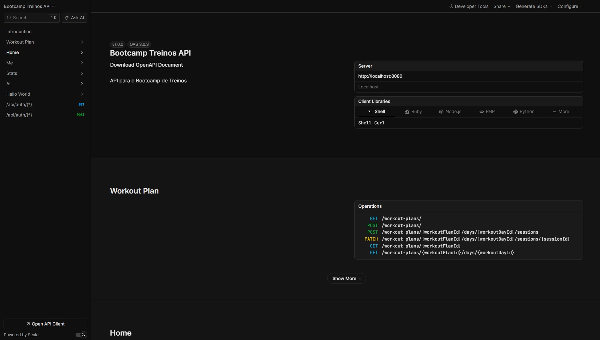

# Bootcamp Treinos API

API para o Bootcamp de Treinos focada na geração e gerenciamento de planos de treino utilizando IA.



## Tech Stack

- **Back-End:** Node.js / Fastify
- **Banco de Dados:** PostgreSQL
- **ORM:** Prisma
- **Linguagem:** TypeScript
- **Validação:** Zod
- **Autenticação:** Better Auth
- **Inteligência Artificial:** Vercel AI SDK (`@ai-sdk/openai`) com OpenAI (`gpt-4o-mini`)
- **Documentação da API:** Swagger / Scalar (`@fastify/swagger` e `@scalar/fastify-api-reference`)

## Principais features

- Autenticação e gestão de sessão de usuários.
- Cadastro e atualização de perfil físico do usuário (peso, altura, idade, % gordura corporal).
- Criação automatizada e personalizada de planos de treino através de Inteligência Artificial.
- Gerenciamento de treinos (planos, dias, exercícios e sessões).
- Inicialização, acompanhamento e conclusão de sessões de treino.
- Visualização de estatísticas do usuário (stats).
- Documentação interativa e completa da API.

## Regras de Negócios

### Perfil Físico
- O peso do usuário (`weightInGrams`) deve sempre ser convertido e salvo em gramas no banco de dados (ex: 70kg = 70.000g).

### Geração de Plano de Treino (IA)
- **Estrutura Obrigatória:** O plano de treino criado pela IA deve conter **exatamente 7 dias** (de MONDAY a SUNDAY), de forma a preencher uma semana completa, independentemente de quantos dias o usuário indicou que pretende treinar.
- **Dias de Descanso:** Dias onde não há treino programado devem ser configurados obrigatoriamente com a flag `isRest: true`, com a lista de exercícios vazia (`exercises: []`) e com a duração estimada zerada (`estimatedDurationInSeconds: 0`).
- **Divisões de Treino (Splits):**
  - **2-3 dias/semana:** Full Body ou ABC (A: Peito+Tríceps, B: Costas+Bíceps, C: Pernas+Ombros)
  - **4 dias/semana:** Upper/Lower (recomendado) ou ABCD (A: Peito+Tríceps, B: Costas+Bíceps, C: Pernas, D: Ombros+Abdômen)
  - **5 dias/semana:** PPLUL (Push/Pull/Legs + Upper/Lower)
  - **6 dias/semana:** PPL 2x (Push/Pull/Legs repetido)
- **Princípios de Montagem:**
  - 4 a 8 exercícios por sessão de treino.
  - 3-4 séries por exercício. O padrão de repetições varia de acordo com o objetivo (ex: 8-12 reps para hipertrofia, 4-6 reps para força).
  - Grupos musculares iguais não devem ser treinados em dias consecutivos.
- **Identidade Visual:** Todo dia de treino deve receber uma imagem de capa (`coverImageUrl`). A imagem é selecionada de um conjunto pré-definido baseado no foco do treino: imagens específicas para foco em membros superiores (ou dias de descanso) e imagens para foco em membros inferiores.

### Gerenciamento de Sessão de Treino
- Não é permitido iniciar, registrar ou atualizar uma sessão de treino em um plano de treino que esteja inativo.
- O sistema valida conflitos de sessões, garantindo que o ciclo de treino obedeça à progressão e rastreabilidade corretas.

## Instalação local

- Clone o repositório e entre na pasta:

```bash
git clone <url-do-repositorio>
cd bootcamp-treinos-api
```

- Instale as dependências usando `pnpm`:

```bash
pnpm install
```

- Configure as variáveis de ambiente copiando o arquivo de exemplo `.env.example` para `.env` (preencha com as credenciais do banco e chave da OpenAI):

```bash
cp .env.example .env
```

- Inicie o banco de dados (ex: utilizando Docker) e sincronize as tabelas:

```bash
docker-compose up -d
pnpm prisma db push
```

- Rode a aplicação:

```bash
pnpm run dev
```

## Estrutura do Projeto

```
src/
├── assets/             # Arquivos estáticos (imagens, ícones, etc.)
├── errors/             # Definição de classes de erro customizadas (ex: ConflictError)
├── generated/          # Arquivos gerados dinamicamente (ex: client do Prisma)
├── lib/                # Configuração de libs externas (ex: Better Auth)
├── routes/             # Definição das rotas RESTful e schemas do Fastify
├── schemas/            # Schemas Zod de tipagem e validação dos dados
├── usecases/           # Casos de uso isolados contendo as regras de negócio
└── index.ts            # Ponto de entrada da aplicação
```

## Documentação da API

Após rodar a aplicação localmente (porta `8080` por padrão), acesse a interface da documentação em:

- **[http://localhost:8080/docs](http://localhost:8080/docs)**
